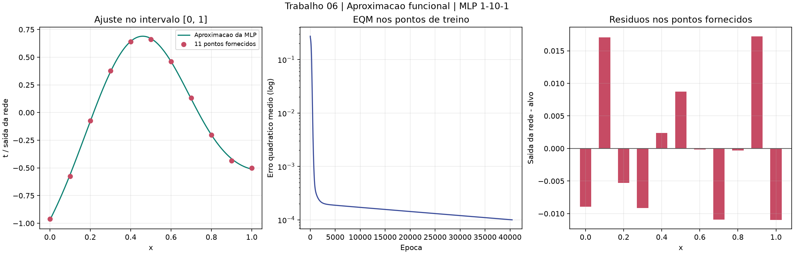

# Trabalho 06 - Aproximacao funcional com MLP

Solucao do [enunciado](../exercicio.md), seguindo a organizacao da Aula 05:
modelo separado da execucao, graficos, resultados auditaveis e testes.
O algoritmo segue a retropropagacao com gradiente descendente apresentada
nos slides locais `sextaaula_retropropagacaodoerro.pptx`; os pontos foram
conferidos em `trabalho06_aproximacaofuncional.pptx`.

## Problema e escolha da rede

Treinar uma rede multicamada para aproximar uma funcao pelos 11 pares
fornecidos, com entradas de 0 a 1. Trata-se de **regressao**, nao classificacao:
a saida deve representar um numero real, inclusive negativo.

A topologia escolhida e **1 -> 10 -> 1**:

- uma entrada escalar, transformada por $u=2x-1$;
- dez neuronios ocultos com ativacao `tanh` e bias;
- um neuronio de saida linear com bias;
- 31 parametros ajustaveis: 10 pesos de entrada, 10 biases ocultos,
  10 pesos de saida e um bias de saida.

O enunciado nao impoe o numero de neuronios. Dez e uma escolha experimental
que atingiu a meta de erro, nao uma demonstracao de arquitetura otima. A
nao linearidade da camada oculta permite representar a curvatura dos pontos;
a saida linear nao restringe o resultado a probabilidades nem a classes.

Os 11 pontos participam do treinamento. Nao ha conjunto de teste separado
nem valores verdadeiros conhecidos entre as amostras. A avaliacao abaixo
mede o ajuste aos pontos fornecidos, **nao a generalizacao**.

## Modelo e retropropagacao

Para uma amostra $i$ e neuronio oculto $j$:

$$
h_{ij}=\tanh(w_j(2x_i-1)+b_j),\qquad
\hat{t}_i=\sum_{j=1}^{10}v_jh_{ij}+c
$$

Portanto, a funcao aproximadora e explicitamente:

$$
\hat{f}(x)=c+\sum_{j=1}^{10}v_j\tanh(w_j(2x-1)+b_j).
$$

Os valores numericos dos pesos e biases treinados estao em
[resultados/modelo.json](resultados/modelo.json). A transformacao da entrada
tambem esta registrada, permitindo reproduzir a funcao fora do programa.

A funcao minimizada e o erro quadratico medio, sem fator $1/2$:

$$
E=\frac{1}{N}\sum_{i=1}^{N}(\hat{t}_i-t_i)^2,\qquad N=11.
$$

Definindo os deltas da saida e da camada oculta:

$$
\delta_i^{(s)}=\frac{2}{N}(\hat{t}_i-t_i),\qquad
\delta_{ij}^{(h)}=\delta_i^{(s)}v_j(1-h_{ij}^2).
$$

As derivadas sao:

$$
\frac{\partial E}{\partial v_j}=\sum_i\delta_i^{(s)}h_{ij},\quad
\frac{\partial E}{\partial c}=\sum_i\delta_i^{(s)},\quad
\frac{\partial E}{\partial w_j}=\sum_i\delta_{ij}^{(h)}(2x_i-1),\quad
\frac{\partial E}{\partial b_j}=\sum_i\delta_{ij}^{(h)}.
$$

Todos os gradientes sao calculados com os mesmos pesos, antes da atualizacao:

$$\theta\leftarrow\theta-\eta\nabla_\theta E.$$

Uma epoca corresponde a uma atualizacao em lote usando os 11 pares. Nao ha
momentum, Adam, softmax ou limiar de classificacao. O historico inclui a
epoca zero e o EQM recalculado depois de cada atualizacao.

## Parametros e resultado obtido

Pesos inicializados uniformemente em
$[-\sqrt{6/11},\sqrt{6/11}]$, biases ocultos em $[-0,1;0,1]$ e bias de saida
igual a zero, com semente 42. A taxa e 0,05. A parada ocorre quando
$E\leq10^{-4}$ ou ao completar 100.000 epocas. O programa informa se atingiu
a meta ou apenas esgotou o limite.

Execucao verificada com os parametros padrao:

| Medida | Resultado |
| --- | ---: |
| Epocas executadas | 40.414 |
| EQM inicial | 0,27296927 |
| EQM final | aproximadamente 0,00010000, abaixo da meta |
| RMSE | 0,00999997 |
| Maior erro absoluto | 0,01723596 |

| x | Alvo | Previsao da MLP | Previsao - alvo |
| ---: | ---: | ---: | ---: |
| 0,0 | -0,960200 | -0,969126 | -0,008926 |
| 0,1 | -0,577000 | -0,559966 | +0,017034 |
| 0,2 | -0,072900 | -0,078184 | -0,005284 |
| 0,3 | +0,377100 | +0,367955 | -0,009145 |
| 0,4 | +0,640500 | +0,642879 | +0,002379 |
| 0,5 | +0,660000 | +0,668749 | +0,008749 |
| 0,6 | +0,460900 | +0,460729 | -0,000171 |
| 0,7 | +0,133600 | +0,122685 | -0,010915 |
| 0,8 | -0,201300 | -0,201598 | -0,000298 |
| 0,9 | -0,434400 | -0,417164 | +0,017236 |
| 1,0 | -0,500000 | -0,510957 | -0,010957 |



**Conclusao:** a MLP treinada aproxima os pontos com erro pequeno segundo
a meta adotada. A linha continua mostra previsoes da rede em 501 entradas
de 0 a 1; nao representa uma funcao verdadeira conhecida. Como ha 31
parametros e apenas 11 observacoes, um bom ajuste nao garante comportamento
correto entre os pontos ou fora do intervalo. Nao foi medida acuracia de
classificacao, pois essa metrica nao se aplica a este problema.

## Executar

Na raiz do workspace, usando o ambiente virtual existente:

```powershell
.\.venv\Scripts\python.exe -m pip install -r 'Aula06 - Redes Multicamadas/EXERCICIO/requirements.txt'
.\.venv\Scripts\python.exe 'Aula06 - Redes Multicamadas/EXERCICIO/main.py'
```

O treinamento termina antes de abrir a janela com os tres graficos finais.
Nao ha animacao do treinamento. Para executar sem janela:

```powershell
.\.venv\Scripts\python.exe 'Aula06 - Redes Multicamadas/EXERCICIO/main.py' --sem-janela
```

Dentro de `EXERCICIO`, com o ambiente virtual ativado:

```powershell
python main.py --ocultos 10 --taxa 0.05 --epocas 100000 --tolerancia 0.0001 --semente 42 --sem-janela
```

Requer Python 3.11+, NumPy e Matplotlib. O modo grafico requer um backend
grafico disponivel; `--sem-janela` usa Agg. Nao usa o projeto solar nem suas
configuracoes. A pasta de saida padrao e relativa ao script, nao ao diretorio
do terminal. Os arquivos de mesmo nome sao substituidos a cada execucao;
use `--saida resultados_experimento` para preservar os resultados anteriores.

## Arquivos

- [mlp.py](mlp.py): dados do enunciado, forward, derivadas e treinamento.
- [main.py](main.py): parametros de execucao, tabela, exportacoes e graficos.
- [test_mlp.py](test_mlp.py): verificacao numerica e testes de regressao.
- [resultados/modelo.json](resultados/modelo.json): configuracao, pesos iniciais
  e finais, metricas e motivo da parada.
- [resultados/predicoes.csv](resultados/predicoes.csv): alvos, previsoes e erros nos 11 pontos.
- [resultados/historico.csv](resultados/historico.csv): EQM por epoca, incluindo epoca zero.
- [resultados/curva.csv](resultados/curva.csv): previsoes em 501 entradas para inspecao da curva.
- [resultados/resultado.png](resultados/resultado.png): curva, erro de treino e residuos.

## Validacao

Na raiz do workspace:

```powershell
.\.venv\Scripts\python.exe -m unittest discover -s 'Aula06 - Redes Multicamadas/EXERCICIO' -p test_mlp.py -v
```

Seis testes verificam os gradientes por diferencas finitas, a regra de
atualizacao, o ajuste com EQM menor ou igual a $10^{-4}$, a semente, os
parametros invalidos, a parada antecipada, a previsao sem modificar pesos,
a reproducao usando o JSON e a exportacao de um grafico nao vazio.